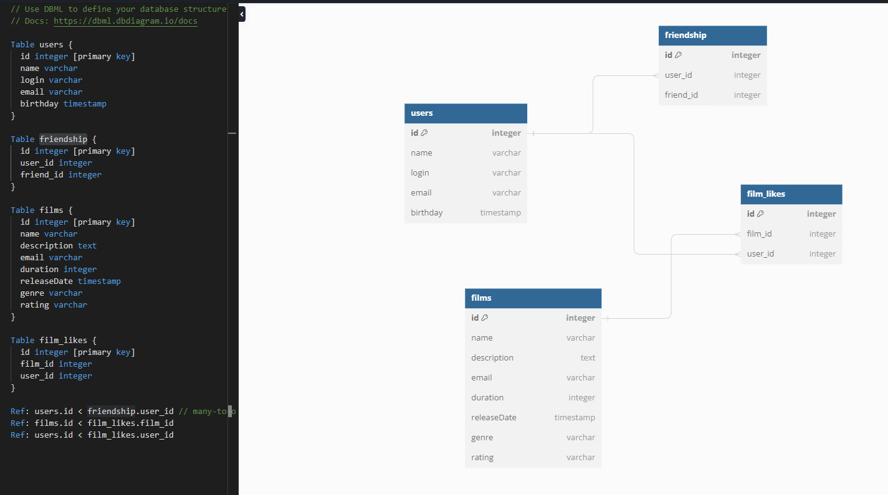

# Схема базы данных


---
## Примеры запросов
<details>
<summary>Получение списка всех фильмов:</summary>

```sql
SELECT *
FROM films
```
</details>
<details>
<summary>Получение списка всех пользователей</summary>

```sql
SELECT *
FROM users
```
</details>
<details>
<summary>Получение N наиболее популярных фильмов:</summary>

```sql
SELECT f.*
FROM films AS f
INNER JOIN film_likes AS fl ON f.id = fl.film_id
GROUP BY f.id
ORDER BY COUNT(f.id) DESC
LIMIT(N)
```
</details>
<details>
<summary>Получение списка общих друзей:</summary>

```sql
SELECT *
FROM users
WHERE user_id IN (SELECT friend_id
                  FROM  (SELECT *
                	 FROM friendship
                         WHERE user_id = X OR user_id = Y) AS test
                  GROUP BY friend_id
                  HAVING COUNT(friend_id) > 1)
```
</details>

---
